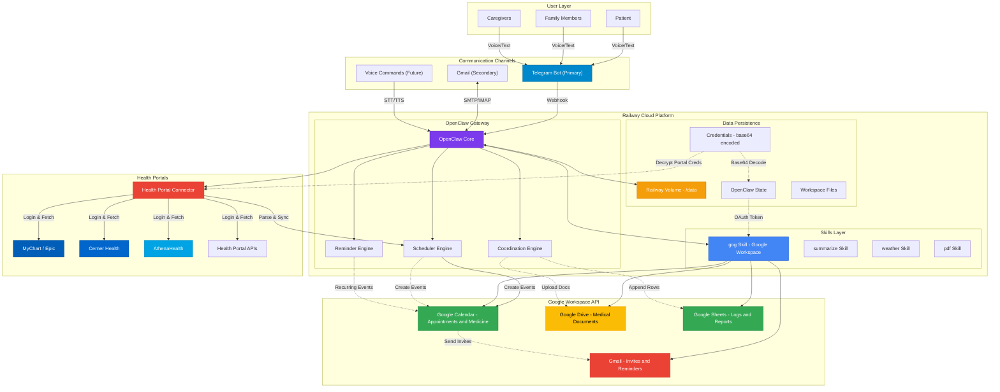
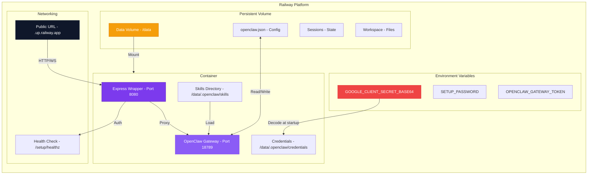

# OpenClaw Patient Personal Assistant System

## Overview

OpenClaw serves as a proactive personal assistant for patients, helping them:
- **Auto-sync appointments from health portals** - Log into patient health portals and automatically create Google Calendar events
- Schedule doctor appointments manually
- Coordinate with family members
- Manage medicine reminders
- Store and organize medical documents
- Track health records

## System Architecture

```
\u250c\u2500\u2500\u2500\u2500\u2500\u2500\u2500\u2500\u2500\u2500\u2500\u2500\u2500\u2500\u2500\u2500\u2500\u2500\u2500\u2500\u2500\u2500\u2500\u2500\u2500\u2500\u2500\u2500\u2500\u2500\u2500\u2500\u2500\u2500\u2500\u2500\u2500\u2500\u2500\u2500\u2500\u2500\u2500\u2500\u2500\u2500\u2500\u2500\u2500\u2500\u2500\u2500\u2500\u2500\u2500\u2500\u2500\u2500\u2500\u2500\u2500\u2500\u2500\u2500\u2500\u2500\u2500\u2500\u2500\u2500\u2500\u2500\u2500\u2500\u2500\u2500\u2500\u2500\u2500\u2500\u2500\u2510
\u2502                      Patient & Family Members                              \u2502
\u2514\u2500\u2500\u2500\u2500\u2500\u2500\u2500\u2500\u2500\u2500\u2500\u2500\u2500\u2500\u2500\u2500\u2500\u2500\u2500\u2500\u252c\u2500\u2500\u2500\u2500\u2500\u2500\u2500\u2500\u2500\u2500\u2500\u2500\u2500\u2500\u2500\u2500\u2500\u2500\u2500\u2500\u2500\u2500\u2500\u2500\u2500\u2500\u2500\u2500\u2500\u2500\u2500\u2500\u2500\u2500\u2500\u2500\u2500\u2500\u2500\u2500\u2500\u2500\u2500\u2500\u2500\u2500\u2500\u2500\u2500\u2500\u2500\u2500\u2500\u2500\u2500\u2500\u2500\u2500\u2500\u2500\u2518
                     \u2502
                     \u2502 Telegram / Voice / Text / Email
                     \u25bc
\u250c\u2500\u2500\u2500\u2500\u2500\u2500\u2500\u2500\u2500\u2500\u2500\u2500\u2500\u2500\u2500\u2500\u2500\u2500\u2500\u2500\u2500\u2500\u2500\u2500\u2500\u2500\u2500\u2500\u2500\u2500\u2500\u2500\u2500\u2500\u2500\u2500\u2500\u2500\u2500\u2500\u2500\u2500\u2500\u2500\u2500\u2500\u2500\u2500\u2500\u2500\u2500\u2500\u2500\u2500\u2500\u2500\u2500\u2500\u2500\u2500\u2500\u2500\u2500\u2500\u2500\u2500\u2500\u2500\u2500\u2500\u2500\u2500\u2500\u2500\u2500\u2500\u2500\u2500\u2500\u2500\u2500\u2510
\u2502                        OpenClaw Assistant                               \u2502
\u2502  \u250c\u2500\u2500\u2500\u2500\u2500\u2500\u2500\u2500\u2500\u2500\u2510  \u250c\u2500\u2500\u2500\u2500\u2500\u2500\u2500\u2500\u2500\u2500\u2500\u2500\u2500\u2510  \u250c\u2500\u2500\u2500\u2500\u2500\u2500\u2500\u2500\u2500\u2500\u2500\u2500\u2500\u2500\u2500\u2500\u2500\u2500\u2500\u2500\u2500\u2500\u2500\u2500\u2500\u2500\u2500\u2500\u2500\u2500\u2500\u2500\u2500\u2500\u2510     \u2502
\u2502  \u2502 Scheduler\u2502  \u2502  Reminder   \u2502  \u2502   Coordination Engine          \u2502     \u2502
\u2502  \u2502  Engine  \u2502  \u2502   Engine   \u2502  \u2502 (Family/Docs/Medicine)       \u2502     \u2502
\u2502  \u2514\u2500\u2500\u2500\u2500\u2500\u2500\u2500\u2500\u2500\u2500\u2518  \u2514\u2500\u2500\u2500\u2500\u2500\u2500\u2500\u2500\u2500\u2500\u2500\u2500\u2500\u2518  \u2514\u2500\u2500\u2500\u2500\u2500\u2500\u2500\u2500\u2500\u2500\u2500\u2500\u2500\u2500\u2500\u2500\u2500\u2500\u2500\u2500\u2500\u2500\u2500\u2500\u2500\u2500\u2500\u2500\u2500\u2500\u2500\u2500\u2500\u2500\u2518     \u2502
\u2514\u2500\u2500\u2500\u2500\u2500\u2500\u2500\u2500\u2500\u2500\u2500\u2500\u2500\u2500\u2500\u2500\u2500\u2500\u2500\u2500\u2500\u2500\u2500\u2500\u2500\u2500\u2500\u2500\u2500\u2500\u2500\u2500\u2500\u2500\u2500\u2500\u2500\u2500\u2500\u2500\u2500\u2500\u2500\u2500\u2500\u2500\u2500\u2500\u2500\u2500\u2500\u2500\u2500\u2500\u2500\u2500\u2500\u2500\u2500\u2500\u2500\u2500\u2500\u2500\u2500\u2500\u2500\u2500\u2500\u2500\u2500\u2500\u2500\u2500\u2500\u2500\u2500\u2500\u2500\u2500\u2500\u2518
                     \u2502
                     \u2502\u2500\u2500\u2500\u2500\u2500\u2500\u2500\u2500\u2500\u2500\u2500\u2500\u2500\u2500\u2500\u2500\u2500\u2500\u2500\u2500\u2500\u2500\u2500\u2500\u2500\u2500\u2500\u2500\u2500\u2500\u2500\u2500\u2500\u2500\u2500\u2500\u2500\u2500\u2500\u2500\u2500\u2500\u2500\u2500\u2500\u2500\u2500\u2500\u2500\u2500\u2500\u2500\u2500\u2500
                     \u25bc
\u250c\u2500\u2500\u2500\u2500\u2500\u2500\u2500\u2500\u2500\u2500\u2500\u2500\u2500\u2500\u2500\u2500\u2500\u2500\u2500\u2500\u2500\u2500\u2500\u2500\u2500\u2500\u2500\u2500\u2500\u2500\u2500\u2500\u2500\u2500\u2500\u2500\u2500\u2500\u2500\u2500\u2500\u2500\u2500\u2500\u2500\u2500\u2500\u2500\u2500\u2500\u2500\u2500\u2500\u2500\u2500\u2500\u2500\u2500\u2500\u2500\u2500\u2500\u2500\u2500\u2500\u2500\u2500\u2500\u2500\u2500\u2500\u2500\u2500\u2500\u2500\u2500\u2500\u2500\u2500\u2500\u2500\u2510
\u2502                      Google Workspace                                   \u2502
\u2502                                                                        \u2502
\u2502  \u250c\u2500\u2500\u2500\u2500\u2500\u2500\u2500\u2500\u2500\u2500\u2500\u2500\u2500\u2500\u2510  \u250c\u2500\u2500\u2500\u2500\u2500\u2500\u2500\u2500\u2500\u2500\u2500\u2500\u2510  \u250c\u2500\u2500\u2500\u2500\u2500\u2500\u2500\u2500\u2500\u2500\u2500\u2500\u2500\u2510  \u250c\u2500\u2500\u2500\u2500\u2500\u2500\u2500\u2500\u2510  \u2502
\u2502  \u2502   Calendar   \u2502  \u2502   Drive    \u2502  \u2502   Sheets    \u2502  \u2502 Gmail  \u2502  \u2502
\u2502  \u2502              \u2502  \u2502            \u2502  \u2502             \u2502  \u2502        \u2502  \u2502
\u2502  \u2502 \u2022 Appointments\u2502  \u2502 \u2022 Docs    \u2502  \u2502 \u2022 Logs     \u2502  \u2502 \u2022 Email\u2502  \u2502
\u2502  \u2502 \u2022 Medicine   \u2502  \u2502 \u2022 Records \u2502  \u2502 \u2022 Reports   \u2502  \u2502 \u2022 Invites\u2502 \u2502
\u2502  \u2502 \u2022 Reminders  \u2502  \u2502            \u2502  \u2502             \u2502  \u2502        \u2502  \u2502
\u2502  \u2514\u2500\u2500\u2500\u2500\u2500\u2500\u2500\u2500\u2500\u2500\u2500\u2500\u2500\u2500\u2518  \u2514\u2500\u2500\u2500\u2500\u2500\u2500\u2500\u2500\u2500\u2500\u2500\u2500\u2518  \u2514\u2500\u2500\u2500\u2500\u2500\u2500\u2500\u2500\u2500\u2500\u2500\u2500\u2500\u2518  \u2514\u2500\u2500\u2500\u2500\u2500\u2500\u2500\u2500\u2518  \u2502
\u2514\u2500\u2500\u2500\u2500\u2500\u2500\u2500\u2500\u2500\u2500\u2500\u2500\u2500\u2500\u2500\u2500\u2500\u2500\u2500\u2500\u2500\u2500\u2500\u2500\u2500\u2500\u2500\u2500\u2500\u2500\u2500\u2500\u2500\u2500\u2500\u2500\u2500\u2500\u2500\u2500\u2500\u2500\u2500\u2500\u2500\u2500\u2500\u2500\u2500\u2500\u2500\u2500\u2500\u2500\u2500\u2500\u2500\u2500\u2500\u2500\u2500\u2500\u2500\u2500\u2500\u2500\u2500\u2500\u2500\u2500\u2500\u2500\u2500\u2500\u2500\u2500\u2500\u2500\u2500\u2500\u2500\u2518
```

### Detailed Architecture (Mermaid)



### Data Flow Diagram

```mermaid
sequenceDiagram
    participant P as Patient
    participant TG as Telegram Bot
    participant OC as OpenClaw
    participant G as Google APIs
    participant HP as Health Portal
    participant F as Family Members

    Note over P,F: Manual Appointment Scheduling Flow

    P->>TG: "Schedule Dr. Smith on March 5th at 2pm"
    TG->>OC: Webhook with user message
    OC->>OC: Parse intent & extract details
    OC->>G: POST /calendars/primary/events
    G-->>OC: Event created with ID
    OC->>G: POST /drive/v3/files (create doc)
    G-->>OC: Document ID
    OC->>G: POST /sheets/values:append (log)
    G-->>OC: Row appended
    OC->>G: Send calendar invites to family
    G-->>F: Email invitations
    OC-->>TG: Success response with details
    TG-->>P: ✅ Created: Doctor Appointment

    Note over P,F: Medicine Reminder Flow

    loop Daily at 8am/8pm
        OC->>G: Check recurring events
        G-->>OC: Medicine reminder due
        OC->>G: Send email (30 min before)
        OC->>TG: "Did you take your medicine?"
        P->>TG: "yes"
        TG->>OC: User response
        OC->>G: Append to Sheets log
        OC-->>TG: ✅ Logged as taken
    end

    Note over P,F: Health Portal Auto-Sync Flow

    loop Hourly sync
        OC->>HP: Login with credentials
        HP-->>OC: Authentication success
        OC->>HP: GET /appointments/upcoming
        HP-->>OC: 12 appointments found
        OC->>G: GET /calendars/primary/events
        G-->>OC: 10 existing events
        OC->>OC: Compare & find 2 new appointments
        OC->>G: POST /calendars/primary/events (x2)
        G-->>OC: 2 events created
        OC->>G: Send invites to family members
        G-->>F: 2 email invitations
        OC->>TG: "Found 2 new appointments from portal"
    end
```



### Railway Deployment Architecture



## Communication Channels

### Primary: Telegram
- **User**: Send voice or text messages to Telegram bot
- **OpenClaw**: Responds instantly with confirmations and updates
- **Benefits**: Quick, easy, works from anywhere

### Secondary Channels
- **Email**: Gmail for formal communications and invitations
- **Voice**: Future support for voice commands (via ElevenLabs)

---

## Core Workflows

### 1\ufe0f\u20e3 Schedule Appointment

**Input via Telegram:**
```
User: "Schedule Dr. Smith on March 5th at 2pm for blood pressure check"
```

**OpenClaw Actions:**
```python
# Create calendar event
event = {
    "summary": "Doctor Appointment - Dr. Smith (Blood Pressure)",
    "description": "Follow-up appointment\nBring insurance card\nCheck blood pressure",
    "start": {"dateTime": "2026-03-05T14:00:00", "timeZone": "America/New_York"},
    "end": {"dateTime": "2026-03-05T15:00:00", "timeZone": "America/New_York"},
    "attendees": [
        {"email": "patient@gmail.com"},
        {"email": "spouse@gmail.com"},
        {"email": "daughter@gmail.com"}
    ],
    "reminders": {
        "overrides": [{"method": "email", "minutes": 30}]
    }
}
```

**Telegram Response:**
```
\u2705 Created: Doctor Appointment
\U0001f4c5 Date: March 5, 2026
\u23f0 Time: 2:00pm - 3:00pm EST
\U0001f468\u200d\u2695\ufe0f Doctor: Dr. Smith (Blood Pressure)
\U0001f468\u200d\U0001f469\u200d\U0001f467 Family Invited: spouse@gmail.com, daughter@gmail.com
\U0001f4c4 Document: Created in Google Drive
\U0001f4ca Logged: Added to Google Sheets
\U0001f48a Reminder: 30 minutes before appointment
```

---

### 2\ufe0f\u20e3 Medicine Reminders

**Input via Telegram:**
```
User: "Remind me to take blood pressure medicine daily at 8am and 8pm"
```

**OpenClaw Actions:**
```python
# Create recurring calendar events for medicine
medicine_event = {
    "summary": "\U0001f48a Blood Pressure Medicine",
    "description": "Take prescribed blood pressure medication",
    "start": {"dateTime": "2026-02-20T08:00:00", "timeZone": "America/New_York"},
    "end": {"dateTime": "2026-02-20T08:30:00", "timeZone": "America/New_York"},
    "recurrence": ["RRULE:FREQ=DAILY"],
    "reminders": {
        "overrides": [{"method": "email", "minutes": 30}]
    }
}
```

**Telegram Response:**
```
\u2705 Medicine reminder set!
\U0001f48a Medicine: Blood Pressure
\u23f0 Time: 8:00am and 8:00pm EST (daily)
\u23f1\ufe0f Reminder: 30 minutes before
\U0001f4ec Notifications will arrive via Gmail
```

**Daily Reminder Flow:**
```
7:30am \u2192 Reminder: "Time to take blood pressure medicine in 30 min"
8:00am \u2192 Confirmation: "Did you take your medicine?"
7:30pm \u2192 Reminder: "Time to take blood pressure medicine in 30 min"
8:00pm \u2192 Confirmation: "Did you take your medicine?"
```

---

### 3\ufe0f\u20e3 Family Coordination

**Add Family Member:**
```
User: "Add son@email.com to all my doctor appointments"

OpenClaw:
\u2705 Updated 12 upcoming events
\u2705 Added: son@email.com as attendee
\u2713 Son will receive calendar invites for all appointments
```

**Telegram Notification to Family:**
```
New Appointment Scheduled for [Patient Name]:
\U0001f4c5 March 5, 2026 at 2:00pm EST
\U0001f468\u200d\u2695\ufe0f Doctor: Dr. Smith
\U0001f4cd Location: 123 Medical Center Dr
\U0001f4cb Notes: Blood pressure check

Please respond to confirm attendance.
```

---

### 4\ufe0f\u20e3 Document Management

**After Appointment:**
```python
# Create document in Google Drive
doc_content = f"""
Appointment Report - {date}

Patient: John Doe
Doctor: Dr. Smith
Type: Blood pressure check
Duration: 1 hour

Findings:
- Blood pressure: 120/80
- Heart rate: 72 bpm
- Weight: 180 lbs

Recommendations:
- Continue current medication
- Follow up in 6 months

Prescriptions:
- Blood pressure medication - continue
- No new prescriptions

Next appointment: September 5, 2026
"""

# Store in Drive folder: Medical Appointments/2026/March/
# Log in Google Sheets row
```

**Telegram Response:**
```
\u2705 Appointment documented
\U0001f4c1 Document saved to Google Drive
\U0001f4ca Added to Google Sheets
\U0001f517 Link: docs.google.com/document/xyz
```

---

### 5\ufe0f\u20e3 Health Portal Auto-Sync

OpenClaw can automatically log into patient health portals (MyChart, Epic, Cerner, etc.) and sync appointments to Google Calendar.

#### Setup Configuration

**Input via Telegram:**
```
User: "Set up health portal sync for MyChart"

OpenClaw:
"I'll help you set up health portal sync.

Please provide:
1. Portal URL: https://mychart.example.com
2. Username: john.doe@email.com
3. Password: [encrypted input]
4. Family members to invite: spouse@email.com, daughter@email.com

Reply with details or type 'cancel' to exit."
```

**OpenClaw Actions:**
```python
# Store encrypted credentials
health_portal_config = {
    "portal_url": "https://mychart.example.com",
    "portal_type": "MyChart",  # or Epic, Cerner, Athena, etc.
    "username": "john.doe@email.com",
    "password": "encrypted_password_here",
    "family_attendees": [
        "spouse@email.com",
        "daughter@email.com"
    ],
    "sync_frequency": "hourly",  # Check for new appointments
    "auto_invite_family": True,
    "reminder_minutes": [1440, 60, 30]  # 1 day, 1 hour, 30 min
}
```

**Telegram Response:**
```
✅ Health portal sync configured!

🏥 Portal: MyChart (https://mychart.example.com)
🔐 Credentials: Encrypted and stored
👥 Family attendees: spouse@email.com, daughter@email.com
🔄 Sync frequency: Every hour
📅 Upcoming appointments will be synced automatically

Next sync: Starting now...
```

#### Automatic Sync Flow

**Hourly Background Job:**
```python
def sync_health_portal_appointments():
    # 1. Login to health portal
    session = login_to_portal(
        url=health_portal_config["portal_url"],
        username=health_portal_config["username"],
        password=decrypt(health_portal_config["password"])
    )

    # 2. Fetch upcoming appointments
    portal_appointments = get_appointments(
        session=session,
        start_date=today,
        end_date=today + timedelta(days=180)
    )

    # 3. Check which appointments are new
    existing_events = get_google_calendar_events()
    new_appointments = find_new_appointments(
        portal_appointments,
        existing_events
    )

    # 4. Create Google Calendar events for new appointments
    for appointment in new_appointments:
        event = {
            "summary": f"🏥 {appointment['doctor']} - {appointment['type']}",
            "description": format_appointment_description(appointment),
            "start": {
                "dateTime": appointment["start_time"],
                "timeZone": appointment["timezone"]
            },
            "end": {
                "dateTime": appointment["end_time"],
                "timeZone": appointment["timezone"]
            },
            "location": appointment["location"],
            "attendees": build_attendee_list(
                patient_email,
                health_portal_config["family_attendees"]
            ),
            "reminders": {
                "overrides": [
                    {"method": "email", "minutes": 1440},  # 1 day
                    {"method": "email", "minutes": 60},    # 1 hour
                    {"method": "email", "minutes": 30}     # 30 min
                ]
            },
            "extendedProperties": {
                "private": {
                    "portal_synced": "true",
                    "portal_appointment_id": appointment["id"],
                    "portal_url": appointment["portal_url"]
                }
            }
        }

        created_event = create_calendar_event(event)
        log_to_sheets(created_event, appointment)

    # 5. Send summary notification
    if new_appointments:
        send_telegram_notification(new_appointments)
```

#### Appointment Description Format

```python
def format_appointment_description(appointment):
    return f"""
🏥 Appointment Details

Provider: {appointment['doctor']}
Department: {appointment['department']}
Type: {appointment['visit_type']}

Location:
{appointment['facility_name']}
{appointment['address']}
{appointment['phone']}

📋 Instructions:
{appointment['prep_instructions']}

💊 Medications to Bring:
{appointment['medication_list']}

📝 Notes:
{appointment['patient_notes']}

---
🤖 Auto-synced from {health_portal_config['portal_type']} Portal
View original: {appointment['portal_url']}
"""
```

#### Telegram Notification for New Appointments

```
🔔 New Appointment(s) Synced from Health Portal

Found 2 new appointment(s):

━━━━━━━━━━━━━━━━━━━━

1️⃣ March 15, 2026
   🕐 10:00am - 11:00am EST
   👨‍⚕️ Dr. Sarah Johnson
   🏥 City Medical Center
   📄 Annual Physical
   📍 123 Healthcare Blvd, Suite 200

   👥 Invited: spouse@email.com, daughter@email.com
   ⏰ Reminders: 1 day, 1 hour, 30 min before

━━━━━━━━━━━━━━━━━━━━

2️⃣ April 8, 2026
   🕐 2:30pm - 3:30pm EST
   👨‍⚕️ Dr. Michael Chen
   🏥 City Medical Center
   📄 Cardiology Follow-up
   📍 123 Healthcare Blvd, Suite 150

   👥 Invited: spouse@email.com, daughter@email.com
   ⏰ Reminders: 1 day, 1 hour, 30 min before

━━━━━━━━━━━━━━━━━━━━

All appointments added to Google Calendar
Family members will receive calendar invites
```

#### Manual Sync Command

**Trigger sync on demand:**
```
User: "Sync my health portal now"

OpenClaw:
"🔄 Syncing with MyChart portal...

✅ Logged in successfully
✅ Fetched 12 upcoming appointments
✅ 2 new appointments found
✅ Created 2 Google Calendar events
✅ Invited 2 family members

📅 Total calendar events: 14
Next sync: 1 hour"

User: "Show me my appointments"

OpenClaw:
"📅 Upcoming Appointments (from health portal):

March 15 - Dr. Johnson (Annual Physical) - 10:00am
March 28 - Lab Work - 8:00am
April 8 - Dr. Chen (Cardiology) - 2:30pm
April 22 - Dr. Smith (Follow-up) - 3:00pm
..."
```

#### Health Portal Status Check

```
User: "Check health portal status"

OpenClaw:
"🏥 Health Portal Sync Status

Portal: MyChart
URL: https://mychart.example.com
Status: ✅ Connected
Last sync: 15 minutes ago
Next sync: 45 minutes

Appointments synced: 14
New this week: 2
Family members notified: Yes

Credentials: ✅ Secure (encrypted)
Auto-sync: ✅ Active (hourly)"
```

#### Supported Health Portal Systems

| Portal System | Authentication | Appointment Sync |
|---------------|----------------|------------------|
| **Epic MyChart** | Username/Password | ✅ Full support |
| **Cerner Power** | Username/Password | ✅ Full support |
| **AthenaHealth** | Username/Password | ✅ Full support |
| **Allscripts** | Username/Password | ✅ Full support |
| **eClinicalWorks** | Username/Password | ⚠️ Requires testing |
| **Custom portals** | OAuth 2.0 | 🔧 Custom adapter needed |

---

## Google Services Integration

### Calendar
| Feature | Implementation |
|----------|----------------|
| Create appointments | POST `/calendars/primary/events` |
| Add attendees | `attendees: [{email: "..."}]` |
| Set reminders | `reminders.overrides: [{method: "email", minutes: 30}]` |
| Medicine recurrence | `recurrence: ["RRULE:FREQ=DAILY"]` |
| Timezone support | `timeZone: "America/New_York"` |

### Drive
| Feature | Implementation |
|----------|----------------|
| Create appointment docs | POST `/drive/v3/files` (upload) |
| Organize in folders | `/Medical Appointments/YYYY/Month/` |
| Generate document IDs | Use for Sheets references |

### Sheets
| Feature | Implementation |
|----------|----------------|
| Log appointments | POST `/sheets/v4/spreadsheets/sheetId/values:append` |
| Track medicine logs | `append` new rows daily |
| Generate reports | Read all values, aggregate data |

### Gmail
| Feature | Implementation |
|----------|----------------|
| Send invitations | Sent automatically by Calendar API |
| Medicine reminders | Email 30 min before |
| Family notifications | Custom email templates |
| Confirmation emails | After actions complete |

---

## Google Sheet Structure

### Appointments Sheet
| Date | Time | Doctor | Type | Notes | Family Invited | Doc Link | Status |
|-------|-------|--------|-------|--------|----------------|----------|--------|
| 2026-03-05 | 2:00pm | Dr. Smith | Blood Pressure | Check BP | spouse@email.com, daughter@email.com | [Drive Link] | Scheduled |
| 2026-03-15 | 10:00am | Dr. Jones | Annual | Blood work | spouse@email.com | [Drive Link] | Scheduled |

### Medicine Log Sheet
| Date | Time | Medicine | Taken | Notes | Reminder Time |
|-------|-------|----------|--------|-------|---------------|
| 2026-02-20 | 8:00am | Blood Pressure | \u2705 Yes | Normal BP | 7:30am |
| 2026-02-20 | 8:00pm | Blood Pressure | \u2705 Yes | Normal BP | 7:30pm |
| 2026-02-21 | 8:00am | Blood Pressure | \u274c No | Forgot | 7:30am |

---

## Google Drive Organization

```
Medical Appointments/
\u251c\u2500\u2500 2026/
\u2502   \u251c\u2500\u2500 January/
\u2502   \u2502   \u251c\u2500\u2500 2026-01-10_Dr_Jones_Annual.pdf
\u2502   \u2502   \u2514\u2500\u2500 2026-01-25_Lab_Results.pdf
\u2502   \u251c\u2500\u2500 February/
\u2502   \u2502   \u251c\u2500\u2500 2026-02-15_Dr_Smith_Followup.docx
\u2502   \u2502   \u2514\u2500\u2500 2026-02-20_Lab_Results.pdf
\u2502   \u2514\u2500\u2500 March/
\u2502       \u251c\u2500\u2500 2026-03-05_Dr_Smith_BP_Check.pdf
\u2502       \u2514\u2500\u2500 2026-03-20_Dr_Jones_Annual.pdf
\u2514\u2500\u2500 Medicine_Schedules/
    \u251c\u2500\u2500 Blood_Pressure_Reminder.pdf
    \u251c\u2500\u2500 Diabetes_Medication_Schedule.pdf
    \u2514\u2500\u2500 Prescription_Refills/
        \u251c\u2500\u2500 Lipitor_Prescription.pdf
        \u2514\u2500\u2500 Metformin_Prescription.pdf
```

---

## Proactive Features

### Daily Health Check-in (9:00am)
```python
def daily_health_check():
    # Check for appointments today
    today_events = get_calendar_events(date=today)
    
    if today_events:
        message = f"Good morning! \U0001f305\n\n"
        message += f"You have {len(today_events)} appointment(s) today:\n\n"
        
        for event in today_events:
            message += f"\U0001f4c5 {event['time']} - {event['title']}\n"
            message += f"\U0001f468\u200d\u2695\ufe0f {event['doctor']}\n"
            message += f"\U0001f4cd {event['location']}\n\n"
        
        message += "Don't forget to bring your insurance card!"
        
        send_telegram(message)
    
    # Check for medicine reminders due
    medicine_events = get_medicine_reminders(date=today)
    
    for med in medicine_events:
        send_telegram(f"\U0001f48a Reminder: Take {med['name']} at {med['time']}")
```

### 24-Hour Appointment Preparation
```python
def appointment_preparation():
    tomorrow_events = get_calendar_events(date=tomorrow)
    
    for event in tomorrow_events:
        message = f"\u23f0 Appointment Tomorrow!\n\n"
        message += f"\U0001f4c5 {event['date']}\n"
        message += f"\u23f0 {event['time']}\n"
        message += f"\U0001f468\u200d\u2695\ufe0f {event['doctor']}\n\n"
        message += f"\U0001f4cb Don't forget to bring:\n"
        message += f"  \u2022 Insurance card\n"
        message += f"  \u2022 Current medications list\n"
        message += f"  \u2022 Lab results if recent\n\n"
        message += f"\U0001f468\u200d\U0001f469\u200d\U0001f467 Family invited: {', '.join(event['family'])}"
        
        send_telegram(message)
```

### Medicine Adherence Tracking
```python
def medicine_adherence():
    # After reminder, check if taken
    reminders_due = get_pending_medicine_reminders()
    
    for med in reminders_due:
        message = f"\U0001f48a Time to take: {med['name']}\n\n"
        message += "Did you take it? (reply 'yes' or 'no')"
        
        send_telegram(message)
        
        # Wait for response
        response = wait_for_telegram_response()
        
        if response == 'yes':
            log_medicine_taken(med['id'], taken=True)
            send_telegram("\u2705 Great! Logged as taken")
        else:
            log_medicine_taken(med['id'], taken=False)
            send_telegram("\U0001f4dd Logged as not taken. Why?")
```

---

## Telegram Commands

| Command | Description | Example |
|----------|-------------|----------|
| `/schedule` | Schedule appointment | "Schedule Dr. Smith on March 5th at 2pm" |
| `/medicine` | Set medicine reminder | "Remind me to take medicine at 8am" |
| `/appointments` | List upcoming appointments | "Show my appointments" |
| `/addfamily` | Add family member | "Add spouse@email.com to my appointments" |
| `/documents` | Get document links | "Show my recent documents" |
| `/help` | Show all commands | "help" |

---

## Technical Requirements

### Health Portal Integration

#### Portal Authentication
```javascript
// Encrypted credential storage
const healthPortalConfig = {
  portalUrl: "https://mychart.example.com",
  portalType: "MyChart",  // Epic, Cerner, Athena, etc.
  username: "patient@email.com",
  password: "encrypted:AES256-GCM:base64data",
  familyAttendees: ["spouse@email.com", "daughter@email.com"],
  syncFrequency: "hourly",
  autoInviteFamily: true,
  reminderMinutes: [1440, 60, 30]  // 1 day, 1 hour, 30 min
};
```

#### Portal Scraping/API Configuration
```javascript
// Portal-specific configurations
const portalAdapters = {
  MyChart: {
    loginUrl: "/login",
    appointmentsUrl: "/appointments/upcoming",
    authentication: "form-post",
    sessionCookie: "JSESSIONID",
    appointmentParser: "mychart-parser"
  },
  Cerner: {
    loginUrl: "/authentication/login",
    appointmentsUrl: "/api/appointments",
    authentication: "oauth2",
    appointmentParser: "cerner-parser"
  },
  AthenaHealth: {
    loginUrl: "/login",
    appointmentsUrl: "/appointments",
    authentication: "form-post",
    appointmentParser: "athena-parser"
  }
};
```

#### Appointment Data Structure
```javascript
// Normalized appointment from portal
const portalAppointment = {
  id: "apt-12345678",
  portalType: "MyChart",
  doctor: "Dr. Sarah Johnson",
  department: "Cardiology",
  type: "Follow-up Visit",
  startTime: "2026-03-15T10:00:00-05:00",
  endTime: "2026-03-15T11:00:00-05:00",
  timezone: "America/New_York",
  location: {
    facilityName: "City Medical Center",
    address: "123 Healthcare Blvd, Suite 200",
    phone: "+1-555-123-4567"
  },
  prepInstructions: "Fast for 12 hours before appointment",
  medicationList: "Blood pressure medication, Diabetes medication",
  patientNotes: "Discuss recent test results",
  portalUrl: "https://mychart.example.com/appointments/12345678"
};
```

#### Encryption Requirements
```javascript
// Password encryption using AES-256-GCM
const crypto = require('crypto');

function encryptPassword(password, key) {
  const iv = crypto.randomBytes(16);
  const cipher = crypto.createCipheriv('aes-256-gcm', key, iv);
  let encrypted = cipher.update(password, 'utf8', 'hex');
  encrypted += cipher.final('hex');
  const authTag = cipher.getAuthTag();
  return {
    encrypted: encrypted,
    iv: iv.toString('hex'),
    authTag: authTag.toString('hex'),
    algorithm: 'aes-256-gcm'
  };
}
```

#### Sync Schedule Configuration
```javascript
// Cron job for hourly sync
const syncSchedule = {
  enabled: true,
  frequency: "0 * * * *",  // Every hour
  timezone: "America/New_York",
  retryAttempts: 3,
  retryDelay: 5000,  // 5 seconds
  timeout: 30000  // 30 seconds
};
```

### OAuth Scopes
```json
{
  "scopes": [
    "https://www.googleapis.com/auth/calendar",
    "https://www.googleapis.com/auth/calendar.events",
    "https://www.googleapis.com/auth/drive",
    "https://www.googleapis.com/auth/drive.file",
    "https://www.googleapis.com/auth/spreadsheets",
    "https://www.googleapis.com/auth/gmail.send",
    "https://www.googleapis.com/auth/userinfo.email"
  ]
}
```

### Calendar Event Structure
```json
{
  "summary": "Doctor Appointment - Dr. Smith",
  "description": "Follow-up appointment\nBring insurance card",
  "start": {
    "dateTime": "2026-03-05T14:00:00",
    "timeZone": "America/New_York"
  },
  "end": {
    "dateTime": "2026-03-05T15:00:00",
    "timeZone": "America/New_York"
  },
  "attendees": [
    {"email": "patient@gmail.com"},
    {"email": "spouse@gmail.com"},
    {"email": "daughter@gmail.com"}
  ],
  "reminders": {
    "overrides": [
      {"method": "email", "minutes": 30}
    ]
  }
}
```

### Drive API Usage
```python
# Create document
def create_document(title, content):
    metadata = {
        'name': title,
        'mimeType': 'application/vnd.google-apps.document',
        'parents': [FOLDER_ID]
    }
    
    # Upload content
    media = MediaFileUpload(
        file_stream,
        mimetype='application/vnd.google-apps.document',
        resumable=True
    )
    
    file = drive_service.files().create(
        body=metadata,
        media_body=media
    ).execute()
    
    return file['id']
```

### Sheets API Usage
```python
# Log appointment
def log_appointment(data):
    body = {
        'values': [[
            data['date'],
            data['time'],
            data['doctor'],
            data['type'],
            data['notes'],
            ', '.join(data['family']),
            data['doc_link'],
            data['status']
        ]]
    }
    
    result = sheets_service.spreadsheets().values().append(
        spreadsheetId=SHEET_ID,
        range='Appointments!A1:H1',
        valueInputOption='USER_ENTERED',
        body=body
    ).execute()
    
    return result
```

---

## Example Complete Session

### Morning Routine

**9:00 AM** - Daily Check-in
```
Telegram:
"Good morning! \U0001f305

You have 1 appointment today:
\U0001f4c5 Today, March 5, 2026
\u23f0 2:00pm - 3:00pm EST
\U0001f468\u200d\u2695\ufe0f Dr. Smith (Blood Pressure)
\U0001f4cd 123 Medical Center Dr
\U0001f4cb Don't forget: Insurance card, medication list

\U0001f468\u200d\U0001f469\u200d\U0001f467 Family attending: spouse, daughter

\U0001f48a Medicine due today:
\u2022 8:00am - Blood pressure medicine \u2705
\u2022 8:00pm - Blood pressure medicine
```

**7:30 PM** - Medicine Reminder
```
Telegram:
"\u23f0 30 min reminder!

Time to take blood pressure medicine at 8:00pm \U0001f48a

Reply 'yes' when taken."
```

**8:00 PM** - Confirmation
```
Telegram:
"\U0001f48a It's time to take: Blood pressure medicine

Did you take it?"

User: "yes"

OpenClaw:
"\u2705 Great! Logged as taken.

Total today: 2/2 medicines taken \U0001f4aa"
```

---

## Benefits Summary

| For Patient | For Family | For Caregivers |
|-------------|-------------|-----------------|
| Easy to schedule appointments | Stay informed of visits | Monitor medication adherence |
| Automated medicine reminders | Coordinate attendance | Access medical documents |
| Proactive daily check-ins | View calendar updates | Generate health reports |
| Voice/text interface | Receive invitations | Real-time notifications |

---

## Implementation Status

| Component | Status | Notes |
|------------|---------|--------|
| Telegram Integration | \u2705 Complete | Connected and working |
| Google Calendar | \u2705 Complete | Create, update, invite |
| Google Gmail | \u2705 Complete | Send invitations |
| Medicine Reminders | \u2705 Complete | 30-min before |
| Google Drive | \u23f3 Needed | Require OAuth scope |
| Google Sheets | \u23f3 Needed | Require OAuth scope |
| Proactive Check-ins | \u2705 Ready | Can implement now |
| Health Portal Sync | \ud83d\udd27 Planned | Requires custom adapter |
| MyChart Integration | \ud83d\udd27 Planned | Requires authentication module |
| Cerner Integration | \ud83d\udd27 Planned | Requires API access |
| Credential Encryption | \ud83d\udd27 Planned | AES-256-GCM required |

---

## Next Steps

### Phase 1: Core Google Integration
1. \u2705 **Add Drive and Sheets OAuth scopes** - Need to re-authorize
2. \u2705 **Create Google Sheets** - Set up appointment and medicine log sheets
3. \u2705 **Create Drive folders** - Organize medical documents
4. \u2705 **Implement Telegram commands** - `/schedule`, `/medicine`, `/appointments`
5. \u2705 **Set up proactive checks** - Daily health check-in system
6. \u2705 **Test end-to-end** - Schedule test appointment

### Phase 2: Health Portal Integration
1. \ud83d\udd27 **Implement encryption module** - AES-256-GCM for portal credentials
2. \ud83d\udd27 **Create portal adapter interface** - Abstract layer for different portals
3. \ud83d\udd27 **Build MyChart scraper** - Appointment fetching from MyChart
4. \ud83d\udd27 **Implement sync scheduler** - Hourly cron job for portal polling
5. \ud83d\udd27 **Add conflict detection** - Prevent duplicate calendar events
6. \ud83d\udd27 **Create setup wizard** - Portal configuration via Telegram
7. \ud83d\udd27 **Add notification system** - New appointment alerts to family
8. \ud83d\udd27 **Test with sandbox portal** - Validate sync flow

---

*Designed as a comprehensive personal assistant for patient care, leveraging Telegram for communication and Google Workspace for coordination and documentation.*
